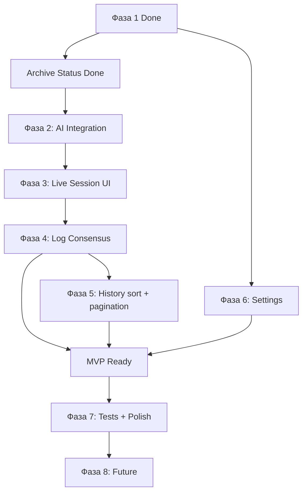

# LOGOS AI — План реализации

> **Дата:** 2026-06-18  
> **Последнее обновление:** 2026-06-18  
> **Связанный документ:** [`logos_ai_project_brief.md`](./logos_ai_project_brief.md)

---

## Текущее состояние

| Область | Статус |
|---------|--------|
| UI shell, навигация, дизайн-система | ✅ |
| Command Center + `initializeBreach` (полная конфигурация) | ✅ |
| Model Registry + `toggleModelActive` | ✅ |
| History: поиск + фильтр по status | ✅ |
| History: sort tabs, pagination | ❌ |
| Archive lifecycle (`ArchiveSession.status`) | ✅ |
| Session page (SSR, read-only) | ⚠️ без streaming |
| PostgreSQL + Prisma (единая init-миграция) | ✅ |
| OpenRouter key stub (`getOpenRouterApiKey`) | ✅ |
| AI debate (ядро продукта) | ❌ |
| Log Consensus | ❌ (stub `finalizeArchiveForConsensus` готов) |
| Settings / Support | ❌ |
| Тесты | ❌ |

**Критический путь:** Фазы 2 → 3 → 4 дают MVP (AI-дебат → live UI → фиксация в архиве).

---

## ✅ Фаза 1 — Расширение схемы и подготовка инфраструктуры (Done)

**Цель:** сохранять полную конфигурацию дебатов и подготовить окружение для AI.

| Шаг | Статус | Реализация |
|-----|--------|------------|
| 1.1 Prisma schema | ✅ | `DebateSession`: `iterations`, `initiator`, `alphaModelId`, `betaModelId`, `currentTurn`, `startedAt`, `completedAt` |
| 1.2 Seed + fixtures | ✅ | `historyData.json`, `debateSession.json`, `prisma/seed.ts`, `mappers.ts`, `types/debate.ts` |
| 1.3 `initializeBreach` | ✅ | Все config-поля сохраняются при создании сессии |
| 1.4 Environment | ✅ | `.env.example`, `src/lib/ai/openrouter.ts` (stub), `README.md`, `AGENTS.md` |

**Миграции:** все изменения объединены в одну init-миграцию `prisma/migrations/20260615173537_init/`.

---

## ✅ Archive Session Status (Done — вне основной нумерации фаз)

**Цель:** lifecycle-статус архива, отдельно от `category` и `winner`.

| Шаг | Статус | Реализация |
|-----|--------|------------|
| Schema | ✅ | `ArchiveSession.status` (default: `initialized`) — в единой init-миграции |
| Types + constants | ✅ | `ArchiveStatus`, `normalizeArchiveStatus()`, `ARCHIVE_STATUS_META`, `getArchiveStatusMeta()` |
| Seed + init | ✅ | Fixtures со `status`; `initializeBreach` → `status: initialized`, `category: UNCLASSIFIED` |
| Lifecycle helpers | ✅ | `src/lib/archive-lifecycle.ts` — `updateArchiveStatus`, `finalizeArchiveForConsensus` |
| UI | ✅ | Status + outcome badges в `ArchiveCard`; фильтр по status в `HistoryView` |

**Статусы:** `initialized` → `active` → `consensus_reached` / `timeout` / `failed` → `archived`

---

## Фаза 2 — AI-интеграция (ядро продукта) — NEXT

**Цель:** серверный endpoint для генерации ответов агентов через OpenRouter.

### Шаг 2.1 — OpenRouter provider

**Файл:** `src/lib/ai/openrouter.ts` — **частично готово**

- ✅ `getOpenRouterApiKey()` + `OpenRouterNotConfiguredError`
- ❌ `createOpenRouter()` provider для AI SDK

```typescript
export function getOpenRouterProvider() {
  return createOpenRouter({ apiKey: getOpenRouterApiKey() });
}
```

### Шаг 2.2 — Prompt engineering

**Новый файл:** `src/lib/ai/prompts.ts`

| Функция | Назначение |
|---------|------------|
| `buildSystemPrompt(agent, framework, role)` | Системный промпт с персоной и целями |
| `buildDebateContext(session, history)` | Контекст: тезис, история, чей ход |
| `buildConsensusPrompt(session, history)` | Финальный промпт для joint decision |

Structured output: `{ text, confidence, evidence[] }`, confidence 0–100.

### Шаг 2.3 — Debate orchestrator

**Новый файл:** `src/lib/ai/debate-orchestrator.ts`

1. Загрузить сессию + историю
2. Определить текущего агента (`initiator` + `currentTurn`)
3. `generateText` / `streamText` через AI SDK
4. Сохранить `DebateMessage`, обновить `currentTurn`, agent status
5. Проверить завершение (`currentTurn >= iterations * 2`)
6. Синхронизировать `ArchiveSession.status` (`initialized` → `active` → …)

### Шаг 2.4 — API route

**Новый файл:** `src/app/api/debate/route.ts`

| Action | Эффект |
|--------|--------|
| `start` | `DebateSession.status → active`, `ArchiveSession.status → active`, `startedAt` |
| `turn` | Один ход, stream SSE |
| `consensus` | Joint decision, `DebateSession.status → consensus_reached`, `ArchiveSession.status → consensus_reached` |

### Шаг 2.5 — Consensus generation

Обновить `DebateSession`: `jointDecisionText`, `alphaAgreement`, `betaAgreement`, `completedAt`.  
Архив **не** финализировать — это Фаза 4 (`logConsensus`).

---

## Фаза 3 — Live Session UI

**Цель:** страница сессии показывает живой дебат со streaming.

| Шаг | Файл | Описание |
|-----|------|----------|
| 3.1 | `SessionView.tsx` | Client wrapper, state: messages, status, isStreaming |
| 3.2 | `SessionView` | Auto-start при `initialized` |
| 3.3 | `useDebateStream.ts` | Debate loop: turn → stream → consensus |
| 3.4 | `AgentStatusCard.tsx` | ACTIVE/IDLE badges, confidence animation |
| 3.5 | `SessionHeader.tsx` | Header по реальному status |
| 3.6 | `MessageLog.tsx` | Streaming append, auto-scroll |
| 3.7 | Error handling | API key banner, retry, partial state |

---

## Фаза 4 — Log Consensus и финализация сессии

**Цель:** зафиксировать результат в архиве.

| Шаг | Статус | Описание |
|-----|--------|----------|
| 4.0 Stub | ✅ | `finalizeArchiveForConsensus()` в `archive-lifecycle.ts` |
| 4.1 | ❌ | Server Action `logConsensus` — вызов stub + revalidate |
| 4.2 | ❌ | Кнопка в `JointDecisionTerminal.tsx` |
| 4.3 | — | MVP: ручной Log Consensus |

**Log Consensus обновляет:** `ArchiveSession.status → archived`, `winner`, `resolution`, `nodes`, `cpu`.

---

## Фаза 5 — History enhancements

**Цель:** полноценная работа с архивом.

| Шаг | Статус | Описание |
|-----|--------|----------|
| 5.0 Status filter | ✅ | Dropdown Filter в `HistoryView` |
| 5.1 Server-side sort | ❌ | Recent / Impact / Duration через searchParams |
| 5.2 Category filter | ❌ | Distinct categories dropdown |
| 5.3 Pagination | ❌ | LOAD ARCHIVE + offset/cursor |

---

## Фаза 6 — Settings, Support, Defaults

| Шаг | Описание |
|-----|----------|
| 6.1 | `/settings` — defaultDebate, registry limits, API key indicator |
| 6.2 | Применить `AppSetting.defaultDebate` на Command Center |
| 6.3 | `/support` — FAQ, docs links |
| 6.4 | `not-found.tsx` |

---

## Фаза 7 — Качество, тесты, polish

- Vitest + tests для prompts, mappers, actions
- `loading.tsx` для session/history
- CI: lint + build

---

## Фаза 8 — Future features (post-MVP)

Human intervention, Export, confidence analytics, 3D Arena, multi-model comparison, AI category classification.

---

## Порядок выполнения



| Milestone | Фазы | Статус |
|-----------|------|--------|
| **M0 — Foundation** | 1 + Archive Status | ✅ Done |
| **M1 — AI работает** | 2 | ❌ Next |
| **M2 — Live UX** | 3 | ❌ |
| **M3 — MVP** | 4 + 5 + 6 | ❌ |
| **M4 — Production-ready** | 7 | ❌ |

---

## Оценка оставшейся работы

| Фаза | Оценка |
|------|--------|
| 2 — AI Integration | 2–3 дня |
| 3 — Live Session UI | 2–3 дня |
| 4 — Log Consensus | 0.5–1 день |
| 5 — History (sort, pagination) | 0.5–1 день |
| 6 — Settings/Support | 1 день |
| 7 — Tests + Polish | 1–2 дня |
| **MVP remaining** | **~7–10 дней** |

---

## Definition of Done (MVP)

- [x] Command Center сохраняет полную конфигурацию дебата
- [x] Archive lifecycle status на History + фильтр
- [x] Model Registry toggles сохраняются
- [x] `npm run lint` и `npm run build` проходят
- [x] README + `.env.example` описывают `OPENROUTER_API_KEY`
- [ ] AI-дебат автоматически стартует после init
- [ ] Live streaming на session page
- [ ] Joint decision генерируется после N итераций
- [ ] Log Consensus финализирует архив
- [ ] History: sort + pagination
- [ ] Settings: default debate config

---

## Ключевые файлы

### Реализовано

| Файл | Назначение |
|------|------------|
| `prisma/migrations/20260615173537_init/` | Единая init-миграция (full schema) |
| `src/lib/ai/openrouter.ts` | API key validation stub |
| `src/lib/archive-lifecycle.ts` | Archive status transitions (Phase 4 stub) |
| `src/constants/archiveStatus.ts` | Status/outcome badge metadata |
| `src/types/history.ts` | `ArchiveStatus`, `normalizeArchiveStatus()` |
| `src/components/history/ArchiveCard.tsx` | Status + outcome badges |
| `src/components/history/HistoryView.tsx` | Search + status filter |

### Следующие (Phase 2+)

| Файл | Фаза |
|------|------|
| `src/lib/ai/prompts.ts` | 2 |
| `src/lib/ai/debate-orchestrator.ts` | 2 |
| `src/app/api/debate/route.ts` | 2 |
| `src/components/session/SessionView.tsx` | 3 |
| `src/hooks/useDebateStream.ts` | 3 |
| `src/actions/consensus.ts` | 4 |
| `src/app/settings/page.tsx` | 6 |
