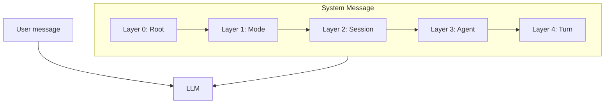

# Иерархия системных промптов LOGOS AI

Системные промпты для LLM-агентов хранятся в виде **слоёв** — от общих правил платформы к частным инструкциям конкретного хода. Сборщик (Фаза 2) конкатенирует слои в одно `system`-сообщение для OpenRouter.

## Зачем

- **Разделение ответственности** — prompt engineering отделён от оркестратора и API routes.
- **Версионирование** — каждый слой имеет `version` в frontmatter; изменения локализованы.
- **Предсказуемая сборка** — один и тот же root-промпт оборачивает все запросы; специфика добавляется ниже.

## Структура папки

```
src/lib/ai/prompts/
├── README.md              ← этот файл
├── types.ts               ← типы для будущего сборщика
└── layers/
    ├── 00-root.system.md  ← Layer 0 (реализован)
    ├── 01-mode.system.md  ← Layer 1 (заглушка)
    ├── 02-session.system.md
    ├── 03-agent.system.md
    └── 04-turn.system.md
```

## Иерархия слоёв

Каждый запрос к LLM получает **одно system-сообщение**. Слои вкладываются сверху вниз — более глубокие уточняют, но не отменяют верхние.



| Слой | Файл | ID | Содержит | Не содержит |
|------|------|-----|----------|-------------|
| 0 | `00-root.system.md` | `root` | Миссия LOGOS AI, принципы диалектики, output contract | Тезис, персонажи, история |
| 1 | `01-mode.system.md` | `mode` | Режим: `debate_turn` или `consensus` | — |
| 2 | `02-session.system.md` | `session` | Тезис, лимит итераций, правила сессии | Имя агента |
| 3 | `03-agent.system.md` | `agent` | Персона, цели, Alpha/Beta | Полная история |
| 4 | `04-turn.system.md` | `turn` | Ход, история, контекст | — (не используется в `consensus`) |

## Правила сборки

1. **Порядок** — всегда `00 → 01 → 02 → 03 → 04` (с пропуском слоёв по `applies_to`).
2. **Разделители** — каждый слой начинается с заголовка `## Layer N: ...` для отладки.
3. **Приоритет** — при конфликте инструкций более специфичный слой побеждает, кроме случаев безопасности и формата output (см. Layer 0).
4. **Placeholders** — в Layer 0 их нет; в слоях 1–4 подставляются переменные сборщиком.
5. **Режим consensus** — включает слои 0–3; Layer 4 (`turn`) пропускается.

### Пример результата сборки (упрощённо)

```
[содержимое 00-root.system.md]

[содержимое 01-mode с mode=debate_turn]

[содержимое 02-session с topic, iterations]

[содержимое 03-agent с agentId, framework]

[содержимое 04-turn с history]
```

## Placeholders

| Placeholder | Источник | Слой |
|-------------|----------|------|
| `{{mode}}` | `"debate_turn"` \| `"consensus"` | 1 |
| `{{topic}}` | `DebateSession.topic` | 2 |
| `{{iterations}}` | `DebateSession.iterations` | 2 |
| `{{agentId}}` | `"alpha"` \| `"beta"` | 3, 4 |
| `{{agentName}}` | `alphaName` / `betaName` | 3 |
| `{{framework}}` | `alphaFramework` / `betaFramework` | 3 |
| `{{currentTurn}}` | `DebateSession.currentTurn` | 4 |
| `{{initiator}}` | `DebateSession.initiator` | 4 |
| `{{history}}` | Сериализованные `DebateMessage[]` | 4 |

Типы переменных: [`types.ts`](./types.ts). Доменные типы: [`src/types/debate.ts`](../../types/debate.ts).

`{{framework}}` соответствует строке из Command Center (`characterDescription` + `Goals`), сохранённой в БД через `buildFramework()` в [`src/actions/debate.ts`](../../actions/debate.ts).

## Формат файлов слоёв

YAML frontmatter + markdown-тело:

```yaml
---
layer: 0
id: root
version: "1.0.0"
required: true
applies_to: [debate_turn, consensus]
---
```

- `layer` — числовой порядок сборки.
- `id` — идентификатор для кода (`PromptLayerId` в `types.ts`).
- `version` — semver слоя; повышать при смысловых изменениях.
- `required` — обязателен ли слой для своего режима.
- `applies_to` — для каких `PromptMode` включается слой.

## Текущий статус vs Фаза 2

| Компонент | Статус |
|-----------|--------|
| Layer 0 (`00-root.system.md`) | ✅ Реализован |
| Layers 1–4 | ⚠️ Заглушки с outline |
| `types.ts` | ✅ Scaffold |
| `assemblePrompt()` / `prompts.ts` | ❌ Фаза 2 |
| Интеграция с `/api/debate` | ❌ Фаза 2 |

Будущий [`src/lib/ai/prompts.ts`](../prompts.ts) будет:

1. Читать файлы из `layers/`.
2. Парсить frontmatter.
3. Подставлять `PromptVariables`.
4. Возвращать `AssembledPrompt` (`{ system, user? }`) для OpenRouter.

## Как редактировать

- **Layer 0** — только универсальные правила. Не добавляйте тезис, персонажей или историю.
- **Layers 1–4** — добавляйте специфику; используйте `{{placeholders}}` для динамических данных.
- При изменении смысла промпта — обновите `version` в frontmatter.
- Текст промптов для LLM — **английский** (лучшее качество рассуждения). Эта инструкция — на русском для команды.

## Связанные документы

- [`logos_ai_implementation_plan.md`](../../../logos_ai_implementation_plan.md) — шаг 2.2 Prompt engineering
- [`AGENTS.md`](../../../AGENTS.md) — архитектура проекта
